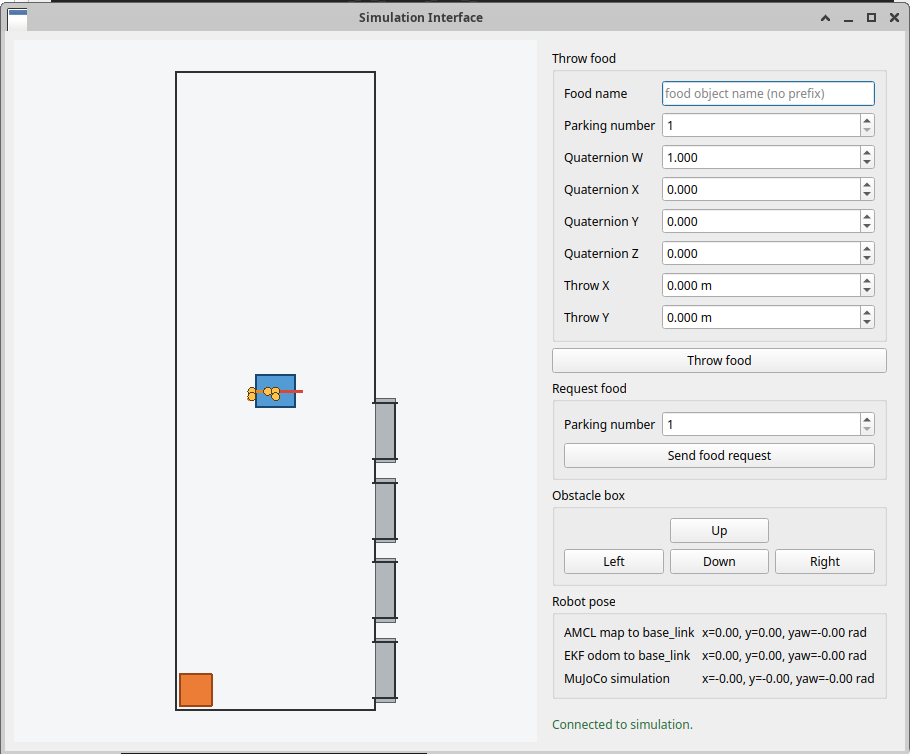

## how to install the system

the following instructions are for windows 10 or 11. start from installing WSL. open a windows terminal as administrator and run

```bash
wsl --install
```

after the installation of WSL run the command

```bash
wsl --install -d Ubuntu-24.04
```

restart windows if requested. open new ubuntu terminal. you can open it from the windows start menu or by running the command

```bash
wsl -d Ubuntu-24.04
```

choose username and passward.

next step is to install [docker desktop](https://www.docker.com/products/docker-desktop/). open settings, go to resources tab, select the pannel of WSL integration and enable integration with Ubuntu.

open new Ubuntu terminal and cd to the user folder. run the command

```bash
git clone https://github.com/gargameld/ROS2-goat-feeding/tree/master
```

(or alternatively drag the folder ROS2-goat-feeding to the user folder). cd to the repository.

the next step is to get an image for the container. you can either pull it from docker hub or alternatively build it by yourself. if you want to build the image run the command

```bash
docker build -t yotambar123/ros-goat-feeding:final
```

if you want to pull the image run the command

```bash
docker pull yotambar123/ros-goat-feeding:final
```

after building/pulling the image start the container:

```bash
docker run -v /home/<ubuntu-username>/ROS2-goat-feeding/workspace:/config/workspace -p 3000:3000 -p 3001:3001 -p 2222:22 -p –name ros2_goat_feeding_container yotambar123/ros-goat-feeding:final
```

## how to run the system

open a browser and enter the address localhost:3000. open a command line and run the following commands to install all the required dependencies:

```bash
cd ~/workspace
```

```bash
sudo rosdep init
```

```bash
rosdep update
```

```bash
rosdep install --from_paths src --ignore_src -r -y
```

build the packages:

```bash
colcon build --symlink-install
```

```bash
source install/setup.bash
```

## configuration of the system

the repository contains many configuration files. since we build with the flag --symlink-install, changing the configurations in the source will automatically change them in the installation and effect the next run. most of the configurations are already tuned for optimized performance and should not be touched, but there are some configurations worth knowing about.


| parameters                                     | location                                                                                    | meaning                                                                                                                                                                              |
| ---------------------------------------------- | ------------------------------------------------------------------------------------------- | ------------------------------------------------------------------------------------------------------------------------------------------------------------------------------------ |
| parking poses,<br>hole poses<br>hole arm poses | robot_behavior/config/map_parameters.yaml                                                   | defines<br>different<br>states the<br>robot needs<br>to reach<br>during the<br>simulation.                                                                                           |
| box dimentions                                 | arm_behavior/config/arm_behavior.yaml                                                       | when the<br>gripper<br>garasps<br>food, the<br>planning<br>scene<br>manager<br>adds box to<br>the<br>planning<br>scene to<br>avoid<br>collision of<br>the food<br>with<br>obstacles. |
| xy_goal_tolerance<br>yaw_goal_tolerance        | navigation_bringup/config/controller_server                                                 | how close<br>the robot<br>will reach to<br>the target<br>pose.                                                                                                                       |
| parking frames                                 | mujoco_ros2_control/mujoco_ros2_control_plugins<br>/config/mujoco_ros2_control_plugins.yaml | defines the<br>frames relative to<br>which you<br>specify the<br>food<br>throwing<br>position in<br>the GUI. it<br>also defines<br>the allowed<br>throwing<br>position<br>range.     |
## adding custom food objects to the simulation

the available foods in the simulation are cube, box, cone, elipsoid and ring. you can also add custom food shapes. in order to do it you need to create an STL file of the food. I recommend to create it from [tinker cad](https://www.tinkercad.com/) 3D editor. once you have a ready STL file, drag it to the folder /config/workspace/mujoco_model/food_items_stl_files.

comment: the GPD is not sophisticated enough and for most of the food objects it fails to find good candidate grasp poses. I recommend starting from box and later try to test the simulation with other objects as well.

## how to run the system

launch the full system from the workspace:

```bash
cd ~/workspace
```

```bash
ros2 launch robot_behavior full_system.launch.py > /config/workspace/capture/launch.log 2>&1
```

if you want to view a splitted log of each node individually run the splitter script:

```bash
python3 capture/split_launch_log.py
```

when launching the full system, 2 windows are going to open. the first window is simulation interface GUI and the second window is RViz viewer (that shows the robot perspective).

in the simulation interface GUI you can find interface to interact with the simulation. 



the Throw food panel enables you to select a food object and throw it on specified shelf on specified orientation and specified position (relative to the offset defined in the file mujoco_ros2_control/mujoco_ros2_control_plugins/config/mujoco_ros2_control_plugins.yaml).

the robot currently knows to handle “box” food object. the intention was to enable the robot to carry any food shape that fits into the gripper but there are problems with the gasp depth that I didn’t have time to fix so it only knows to find grasp poses for high objects. so right now there is only support for box food.

request food panel lets you choose a parking/shelf from which the food should search for food.

the obstacle panel enables you to move the obstacle and block the way of the robot. you can try to block the way of the robot while it is navigating and see it moving around the obstacle.

throw the food to some parking in selected position and send a food request to the parking. you will see the robot navigating to the corresponding parking, lifting the food, carrying it and throwing it to the corresponding hole. it takes about 20 minutes to run full simulation (because there is no GPU acceleration).

## viewing the simulation from MuJoCo viewer

after the simulation is finished and the robot throws the food to the hole, you can view the simulation from mujoco viewer. close the ROS2 system (just press control+c on the terminal from which you started the simulation). run the command

```bash
python3 capture/simulation_3d_interface/live_mujoco_viewer.py
```

for any additional questions contact me. my email is yotam.ambar@gmail.com.
